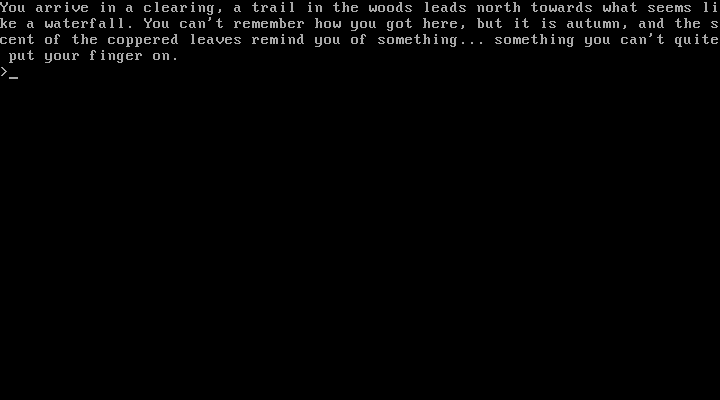

# Bare Metal x86 Rambling Simulator

Simple text venture game (an adventure game minus the action) that runs without any OS. The x86 bootstrapping shenanigans are implemented using the excellent guide by Nick Blundell, which you can find [here](https://www.cs.bham.ac.uk/~exr/lectures/opsys/10_11/lectures/os-dev.pdf) (or [archive link](https://archive.is/ty6BA) ).



## Prerequisites
To build and run using the files in this project you need:

[NASM](https://www.nasm.us/) assembler

[QEMU](https://www.qemu.org/) emulator

_both must be available in your PATH_

## Usage
Windows:
```
./build
./run
```


